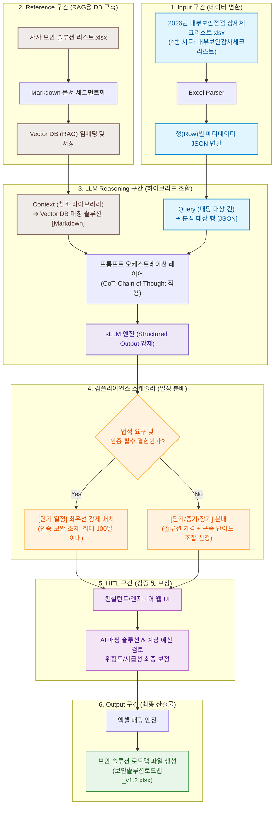

# [개발 기획] 보안 로드맵 수립 에이전트 (AX 솔루션)

본 기획서는 AI 기술을 활용하여 기업의 내부 보안 점검 결과를 분석하고, 자사 보안 솔루션 DB를 기반으로 실효성 있는 연차별 보안 솔루션 로드맵을 자동으로 수립하는 **"보안 로드맵 수립 에이전트(Security Roadmap Synthesis Agent)"** 솔루션의 아키텍처 및 상세 설계 내용을 담고 있습니다.

---

## 1. 솔루션 개요 및 비즈니스 가치

### 1.1 개요
전통적인 보안 컨설팅은 컨설턴트가 기업의 보안 실태(체크리스트)를 분석하여 수동으로 개선방안과 로드맵을 작성하는 방식으로 진행되었습니다. 이는 **긴 소요 시간, 컨설턴트 개인 역량에 따른 결과물 편차, 자사 솔루션 매핑 누락** 등의 한계를 가집니다.
본 솔루션은 이러한 수동 컨설팅 업무에 **AX(AI Transformation)**를 적용하여 다음과 같은 핵심 가치를 제공합니다.
- **자동 매핑 프로세스:** 고객사의 내부 보안 점검 결과(운영현황/개선방안)를 즉각 분석하여 매칭되는 자사 솔루션을 자동 추천합니다.
- **컴플라이언스 기반 스케줄링:** 법적 요구사항(개인정보보호법, 정보통신망법 등)과 시급성 및 위험도를 종합적으로 고려하여 로드맵 수립 일정을 자동 분배합니다.
- **휴먼 인 더 루프(HITL):** 최종 결과물을 바로 엑셀로 내보내기 전, 컨설턴트가 UI에서 추천 정합성을 검증 및 미세조정할 수 있도록 지원합니다.

---

## 2. 전체 설계 워크플로우 다이어그램

본 솔루션은 데이터 업로드부터 최종 로드맵 파일 생성까지 총 6단계의 워크플로우로 동작합니다.



---

## 3. 동작 시스템 아키텍처

보안 로드맵 수립 에이전트는 **클라이언트(Frontend), 백엔드 API(Backend), AI 오케스트레이터(Orchestrator), 그리고 데이터 가공 파이프라인**으로 구성됩니다.


### 3.1 아키텍처 상세 설명

1. **컨설턴트 Web UI (Frontend):**
   - 체크리스트 엑셀 파일을 업로드하고 파싱 결과를 테이블 형태로 확인합니다.
   - LLM이 수립한 로드맵 결과(보안영역, 과제명, 예상예산, 일정 등)를 드래그 앤 드롭 및 스코어 보정 방식으로 변경할 수 있는 인터랙티브 대시보드를 제공합니다.
2. **API Gateway / Controller (Backend):**
   - 파일 업로드/다운로드 API 처리 및 전후처리 비즈니스 로직을 제어합니다.
3. **엑셀 파싱/작성 엔진 (openpyxl / pandas):**
   - **업로드용:** 4번 시트의 2단 병합 헤더 구조(`평가|운영현황|개선방안`)를 감지하여 정확한 셀 데이터를 추출하고 JSON으로 정규화합니다.
   - **다운로드용:** 수집된 최종 JSON 데이터를 로드맵 템플릿(23열 이후의 서식) 구조에 맞게 셀 서식을 유지하며 Write합니다.
4. **LangChain 프롬프트 오케스트레이터:**
   - Vector DB에 질의하기 위한 Query 임베딩을 생성하고 RAG 검색을 제어합니다.
   - Context용 Markdown 문서와 Query용 JSON 객체를 동적으로 프롬프트에 조립하여 LLM에 전달합니다.
5. **ChromaDB / Vector DB:**
   - 자사 보안 솔루션 명세서의 Markdown 텍스트 정보를 벡터화하여 저장하며, 컨설팅 개선방안 텍스트를 질의로 하여 유사도가 가장 높은 상위 $N$개의 솔루션을 검색합니다.
6. **sLLM Engine:**
   - JSON Schema를 프롬프트에 주입하거나 API 수준에서 JSON 모드(Structured Output)를 강제하여 지정된 키 값을 누락 없이 완벽한 JSON 데이터로 반환받습니다.

---

## 4. 상세 데이터 파이프라인 (Input ➔ Reference ➔ Reasoning ➔ Output)

### 4.1 Input 구간: 입력 엑셀 장표 데이터 ➔ [JSON]
사용자가 업로드한 `2026년 OO기업명_내부보안점검_상세체크리스트_테스트 파일.xlsx`의 **4번 시트(내부보안감사체크리스트)**는 아래 규칙으로 JSON 배열 변환을 수행합니다.

- **파싱 규칙:**
  - Row 0, 1은 헤더로 파악하여 건너뜁니다.
  - Col 2(항목명), Col 3(세부점검내용), Col 4(평가), Col 5(운영현황 및 증적), Col 6(개선방안) 셀 데이터를 바인딩합니다.
  - 평가 항목이 `X`인 경우(결함 자산)에만 보안 솔루션 로드맵 수립 대상으로 선별하여 처리 효율성을 높입니다.

- **JSON 변환 스키마 예시:**
```json
[
  {
    "row_idx": 3,
    "항목명": "1. 정책, 조직 관리",
    "세부점검내용": "1.1 조직이 준수하여야 하는 정보보호 및 개인정보보호 관련 법적 요구사항을 파악하여 최신성을 유지하고 있는가?",
    "평가": "X",
    "운영현황_증적": "● 정보보호 규정 및 지침이 있으며, 매년 변경하지는 못하고 있으나 최근에 변경계획을 세우고 있음. 고객정보를 보유하고 있음 (6만 6천여명)",
    "개선방안": "● 개인정보보호법 및 정보통신망법 등의 법적준거성을 확인하고 매년 정보보호 정책 및 규정을 반영하여야 함"
  }
]
```

### 4.2 Reference 구간: DB 내 솔루션/전체 내용 ➔ [Markdown]
참조용 `자사 보안 솔루션 리스트 (1).xlsx` 파일은 Vector DB 검색 효율과 LLM의 문맥 이해도를 높이기 위해 가독성이 높은 구조화된 **Markdown** 포맷으로 세그먼트화하여 임베딩을 수행합니다.

- **Markdown 변환 구조 예시:**
```markdown
# [솔루션 정보] NGFW A (차세대 방화벽)
- **보안영역**: 네트워크 보안
- **제조사**: Fortinet
- **모델명**: FG 시리즈
- **주요 기능 및 특징**:
  - 'Fortinet의 FG 시리즈'는 애플리케이션 식별 및 정밀 제어 수행
  - 침입 방지 시스템(IPS), 안티바이러스, 웹 필터링 통합 제공
  - SSL/TLS 암호화 트래픽 복호화 및 고속 검사 지원
```

### 4.3 LLM Reasoning 구간: 프롬프트 컨텍스트 ➔ [하이브리드 조합]
LLM에게 매핑을 요청하는 프롬프트 오케스트레이션 레이어에서는 **RAG 검색 결과(Markdown)**와 **분석 타겟 행 데이터(JSON)**를 물리적으로 구분하여 하이브리드 형태로 주입합니다.

- **프롬프트 템플릿 설계:**
```text
[역할 정의]
너는 전문적인 CISO 수준의 정보보안 컨설팅 에이전트이다. 
주어진 [고객사 개선요구사항]에 완벽히 매칭되는 자사 보안 솔루션을 [자사 솔루션 라이브러리]에서 식별하여 결과를 JSON 포맷으로 도출하라.

[자사 솔루션 라이브러리 (Context - Markdown 포맷)]
{retrieved_solutions_markdown}

[고객사 개선요구사항 (Query - JSON 포맷)]
{
  "항목명": "{항목명}",
  "세부점검내용": "{세부점검내용}",
  "운영현황_증적": "{운영현황_증적}",
  "개선방안": "{개선방안}"
}

[출력 요구사항 및 제약조건]
1. 개선방안을 해결할 수 있는 최적의 솔루션을 '자사 솔루션 라이브러리'에서 선택하라.
2. 매핑 후, 다음 필드들을 필수로 채운 JSON 객체만 출력하라. (마크다운 코드 블록 금지)
   - 보안영역: 매핑된 솔루션의 보안영역
   - 과제명: "[솔루션 명] 도입 및 구축" 형태
   - 법적요구: 개인정보보호법 등 관련 법적 근거가 매칭될 경우 기재 (없으면 "N/A")
   - 시급성(1~5): 결함 심각도 및 법적 중요도에 따른 점수
   - 위험도(1~5): 미도입 시 보안 위협 노출 가능성에 따른 점수
   - 예상예산: 솔루션 등급에 따라 산정
   - 추천사유: 왜 이 솔루션이 개선방안의 해결책이 되는지에 대한 구체적 논리 (Chain-of-Thought)
```

### 4.4 Output 구간: 결과 도출 ➔ 최종 엑셀 변환 ➔ [JSON]
LLM이 생성한 정형화된 JSON 출력값은 검증을 거친 후, `2026년 OO그룹_기업명 정보보안감사_보안솔루션로드맵_v1.2.xlsx` 양식에 맞추어 엑셀 파일로 최종 작성됩니다.

- **LLM 최종 JSON 출력 결과 예시:**
```json
{
  "보안영역": "네트워크 보안",
  "과제명": "NGFW A 차세대 방화벽 도입 및 망 분리",
  "법적요구": "개인정보 보호법 제29조(안전조치의무)",
  "시급성": 4,
  "위험도": 5,
  "예상예산": "₩50,000,000",
  "추천사유": "고객정보를 대량으로 보유하고 있으나, 비인가 외부 트래픽을 정밀 제어할 차세대 방화벽(NGFW) 솔루션이 부재함. 따라서 Fortinet FG 시리즈 기반의 방화벽 고도화를 추진하고 망 제어 규칙을 강화해야 함."
}
```

---

## 5. 컴플라이언스 및 장단기 로드맵 분배 로직

단순히 시급성과 위험도가 높다고 모든 솔루션을 1년 차에 도입할 수는 없습니다(예산 및 구축 리소스의 한계). 따라서 시스템 내 **컴플라이언스 스케줄러**가 예산과 위험도를 고려하여 3개년 로드맵 연도(2026년, 2027년, 2028년 등)로 과제를 지능적으로 배분합니다.

```
                  [ LLM 매핑 결과 수신 ]
                            │
               (질의: 법적 요구사항이 존재하거나
                인증 취득에 필수적인 결함인가?)
               /                             \
           [Yes]                             [No]
             │                                │
      [단기 최우선 과제]               (시급성 × 위험도 매트릭스 계산)
    (Next Year / 1년차 배치)         - 고위험/고시급성 (Score ≥ 16): 1~2년차
                                     - 중위험/중시급성 (Score 8~15): 2~3년차
                                     - 저위험/저시급성 (Score ≤ 6): 3년차 이후
                                              │
                                   (예상 예산 한도 적용 필터링)
                                   - 당해연도 한도 초과 시 차년도 이월
```

1. **컴플라이언스 최우선 배치 (법적 요구 및 인증 필수 결함):**
   - `법적요구` 필드에 값(예: 개인정보 보호법, 정보통신망법 등)이 기입되었거나 필수 심사 항목의 결함인 경우, 시급성을 무조건 최상위(5)로 상향 조정하고 로드맵 연도를 **1년 차(당해 연도)**에 강제 배치합니다.
2. **시급성-위험도 매트릭스 스코어링:**
   - $\text{Score} = \text{시급성}(1\sim5) \times \text{위험도}(1\sim5)$
   - $\text{Score} \ge 16$: 1개년 차 배치 대상
   - $8 \le \text{Score} < 16$: 2개년 차 배치 대상
   - $\text{Score} < 8$: 3개년 차 배치 대상
3. **연차별 예산 한도(Cap) 필터링:**
   - 특정 연도에 배정된 총예산이 사전에 설정된 예산 임계치(예: 1년 차 1.5억 원)를 초과하는 경우, 스케줄러는 스코어 및 우선순위가 상대적으로 낮은 과제부터 순차적으로 차년도(2년 차 또는 3년 차)로 이월 조정합니다.

---

## 6. Human-in-the-Loop (HITL) 및 UI 검토 가이드

AI 모델의 환각(Hallucination) 및 부적절한 예산 측정을 방지하고 결과의 정합성을 최종 확보하기 위해, 사람이 중간에 개입하여 조율할 수 있는 단계와 검토 인터페이스가 제공됩니다.

### 6.1 웹 UI 검토 테이블 구조
컨설턴트는 아래 화면 설계를 바탕으로 매핑 결과를 최종 검증합니다.

| 행번호 | 체크리스트 항목명 | 운영현황 및 개선방안 | AI 추천 솔루션 | 시급성 | 위험도 | 예상예산 | 로드맵 연도 | 검증 상태 |
| :---: | :--- | :--- | :--- | :---: | :---: | :---: | :---: | :---: |
| 12 | 인증 및 권한 관리 | 2FA 미적용 / 추가 도입 필요 | **Chakra Max (DB접근제어)** | 4 | 5 | ₩35,000,000 | 2026년 | `[승인 / 수정 / 보류]` |
| 15 | 시스템 보안 | 서버 취약점 패치 프로세스 부재 | **Hiware (시스템접근제어)** | 3 | 3 | ₩25,000,000 | 2027년 | `[승인 / 수정 / 보류]` |

### 6.2 조정 작업 시나리오
1. **솔루션 변경:** AI가 매핑한 `Chakra Max` 솔루션 대신, 고객 환경에 따라 타 벤더나 대안 솔루션으로 변경하고 싶을 경우 셀을 클릭하면 Vector DB에 유사하게 검색된 대체 솔루션 리스트가 드롭다운으로 표시되어 즉시 교체할 수 있습니다.
2. **연도 수동 잠금 (Locking):** 예산 이슈나 사업계획 변경으로 2026년 과제를 2028년으로 수동 이동 시, "잠금" 처리를 통해 예산 스케줄러 재작동 시 해당 과제가 밀려나지 않도록 보호합니다.

---

## 7. 최종 데이터 스키마 정의 (엑셀 파일 3종 매핑 명세)

시스템에서 생성되는 최종 로드맵 엑셀의 데이터 구조는 업로드된 내부보안점검 체크리스트 데이터와 자사 보안 솔루션 리스트를 바탕으로 1:1 결합 및 재작성됩니다.

### 7.1 입력 체크리스트 스키마 (`2026년 OO기업명_내부보안점검_상세체크리스트_테스트 파일.xlsx`)
- **대상 시트:** `내부보안감사체크리스트`

| 컬럼 위치 | 헤더 필드명 | 데이터 예시 | 비고 |
| :---: | :--- | :--- | :--- |
| Col 2 | 항목명 | 1. 정책, 조직 관리 | 대분류 보안 영역 |
| Col 3 | 세부점검내용 | 1.1 법적 요구사항을 파악하여... | 점검 기준 설명 |
| Col 5 | 운영현황 및 증적 | ● 정보보호 규정 및 지침이 있으며... | 현재 수준 상세 |
| Col 6 | 개선방안 | ● 개인정보보호법에 의한 정책 반영... | 개선 지향점 |

### 7.2 자사 솔루션 DB 스키마 (`자사 보안 솔루션 리스트 (1).xlsx`)
- **대상 시트:** `Sheet1`

| 컬럼 위치 | 필드명 | 데이터 예시 | 역할 |
| :---: | :--- | :--- | :--- |
| Col 0 | 보안영역 | 네트워크 보안 / 시스템 보안 | RAG 1차 필터링용 영역 구분 |
| Col 2 | 솔루션 명 | NGFW A(차세대방화벽) | 로드맵 상의 핵심 과제 대상명 |
| Col 3 | 제조사 | Fortinet | 추천 솔루션의 벤더 정보 |
| Col 4 | 모델명 | FG 시리즈 | 상세 규격 |
| Col 5 | 기능 및 특징 | Fortinet의 FG 시리즈는 차세대 방화벽 기능... | CoT 및 추천 사유 생성용 텍스트 컨텍스트 |

### 7.3 최종 로드맵 스키마 (`2026년 OO그룹_기업명 정보보안감사_보안솔루션로드맵_v1.2.xlsx`)
- **대상 시트:** `01_OO그룹(OO기업명)` (25행부터 작성 시작)

| 최종 열 위치 | 구분 그룹 | 컬럼 명칭 | 매핑 및 도출 규칙 |
| :---: | :--- | :--- | :--- |
| **Col 0** | - | No. | 1부터 시작하는 일련번호 |
| **Col 1** | **기업명_내부보안점검_상세체크리스트** | 항목명 | 입력 체크리스트 Col 2 데이터 전사 |
| **Col 2** | **기업명_내부보안점검_상세체크리스트** | 세부점검내용 | 입력 체크리스트 Col 3 데이터 전사 |
| **Col 4** | **기업명_내부보안점검_상세체크리스트** | 운영현황 및 증적 | 입력 체크리스트 Col 5 데이터 전사 |
| **Col 6** | **기업명_내부보안점검_상세체크리스트** | 개선방안 | 입력 체크리스트 Col 6 데이터 전사 |
| **Col 8** | **보안솔루션 로드맵** | 보안영역 | 자사 솔루션 DB의 Col 0 데이터 매핑 |
| **Col 9** | **보안솔루션 로드맵** | 과제명 | `"[자사 솔루션 명] 도입 및 보안 통제 강화"` 형식으로 LLM이 작성 |
| **Col 10** | **보안솔루션 로드맵** | 법적요구 | LLM이 관련 법령 식별 후 작성 (예: 개인정보보호법 제00조) |
| **Col 11** | **보안솔루션 로드맵** | 시급성(1~5) | LLM이 평가한 우선순위 점수 |
| **Col 12** | **보안솔루션 로드맵** | 위험도(1~5) | LLM이 평가한 보안 위협 노출 점수 |
| **Col 13** | **보안솔루션 로드맵** | 예상예산 | 솔루션 단가 라이브러리 및 구축 규모 기준 산정 |
| **Col 14** | **보안솔루션 로드맵** | 로드맵연도 | 스케줄러 배분 또는 HITL 조정 후 확정된 연도 (예: 2026년) |
| **Col 15** | **보안솔루션 로드맵** | 비고 | 도입 필요성 및 기대 효과 (Chain-of-Thought 산출 근거 요약) |
