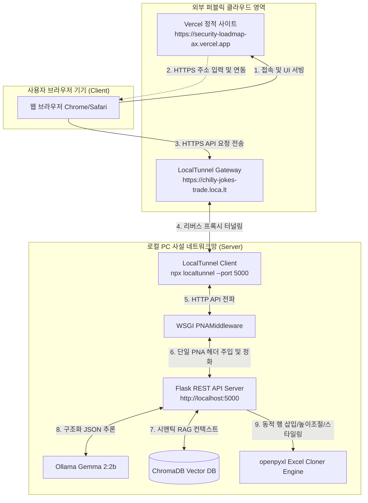
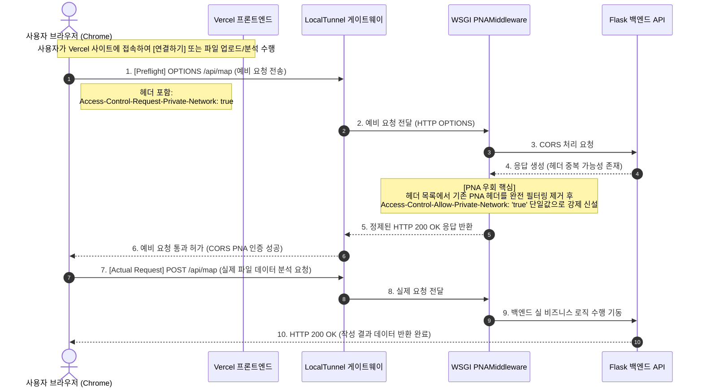
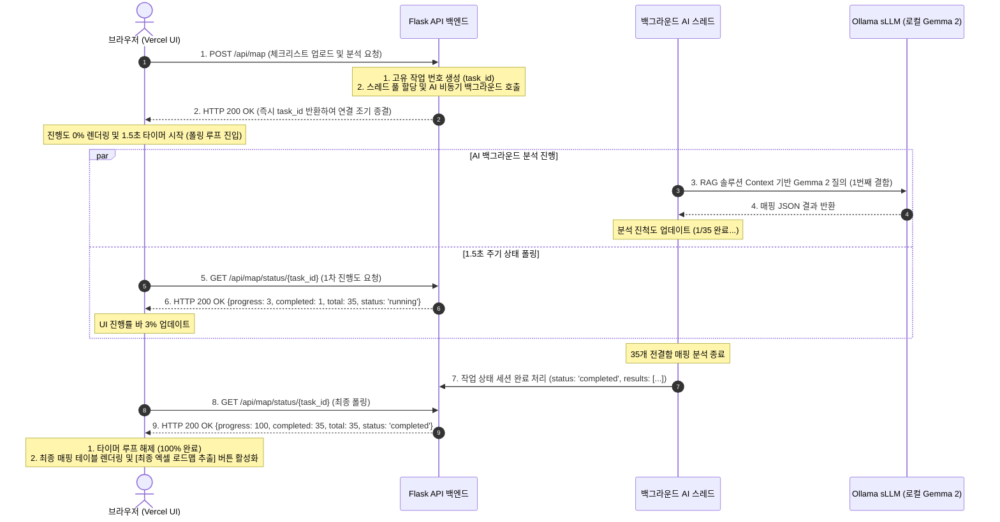
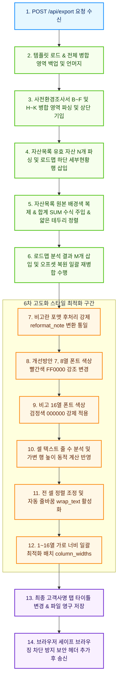

# 외부 공유 워크플로우 및 다이어그램

본 문서는 **Security Roadmap Agent** 시스템의 Vercel 프론트엔드(HTTPS)와 로컬 사설망 내의 AI 백엔드 API(Flask, Ollama, ChromaDB) 간 연동 구조, 보안 통제 우회, 그리고 LocalTunnel 타임아웃 극복을 위한 비동기 상태 조회의 데이터 흐름 및 상호작용 프로세스를 시각화합니다.

---

## 1. 물리적 네트워크 및 서비스 구조도

Vercel은 외부 사용자를 향한 게이트웨이 역할을 수행하며, 로컬 환경은 사설망에 위치하여 민감 정보를 처리합니다. 두 레이어는 LocalTunnel의 HTTPS 중계 터널링 채널을 매개로 소통합니다.

---

## 2. Chrome PNA (Private Network Access) 사전 승인 시퀀스

크롬 브라우저가 외부 퍼블릭 영역(Vercel)에서 사설 도메인(LocalTunnel 리다이렉트망)으로 접근 시, PNA 규격에 의거해 예비 요청(`Preflight request`)을 먼저 보낸 뒤 실제 데이터 요청을 전송하는 핸드셰이크 프로세스 다이어그램입니다.

---

## 3. 비동기 분석 기동 및 1.5초 실시간 폴링 (Polling) 워크플로우

로컬서버-게이트웨이 간 60초 타임아웃(504 Gateway Timeout) 한계를 극복하고 대용량 AI 분석 진행률을 실시간 브라우저에 표시하기 위해 설계된 비동기 상태 추적 파이프라인의 구조입니다.

---

## 4. 엑셀 동적 병합 및 가시성 최적화 최종 추출 파이프라인

사용자가 엑셀 추출을 명령했을 때 백엔드 엔진 내부에서 일어나는 데이터 파싱, 동적 행 연산, 서식 복사 및 스타일 보정의 데이터 파이프라인 흐름도입니다.

