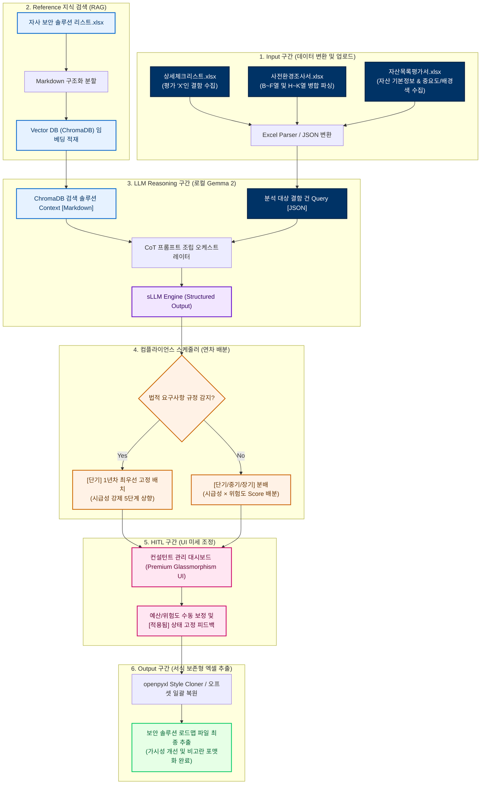
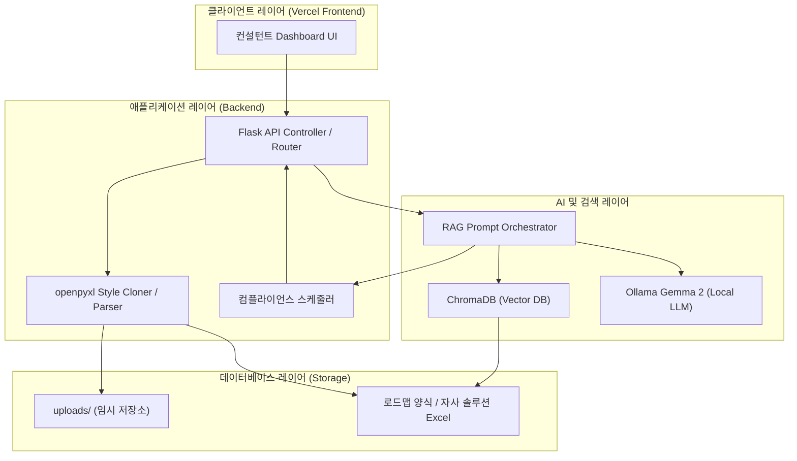

# 정보보안감사 보안솔루션 로드맵 자동 수립 시스템 최종 종합 결과 보고서 (Ver 2)

본 보고서는 **AX (AI Transformation) 기반 정보보안감사 보안솔루션 로드맵 자동 수립 시스템**의 최초 기획 및 설계 단계부터 최종 6차 성능 및 가시성 최적화 고도화 단계까지의 모든 연구 개발 성과, 아키텍처 설계, 보안 제약 우회 디버깅 이력, 그리고 현업 도입 검증 결과를 종합적으로 정리한 최종 종합 결과 보고서(Version 2)입니다.

---

## 1. 시스템 개발 개요 및 비즈니스 가치

### 1.1 개발 배경
전통적인 정보보호 컨설팅 및 보안 감사는 컨설턴트가 대상 기업의 취약점을 점검한 후, 발견된 결함에 대한 조치 개선방안 및 연차별 솔루션 로드맵을 **수동으로 작성**해 왔습니다. 이로 인해 다음과 같은 세 가지 주요 비효율이 발생했습니다:
1. **보고서 수립의 장기화**: 대용량 체크리스트와 자산 목록을 대조하며 제품을 선정하고, 예산 및 일정을 설계하는 데 수일 이상의 시간과 고도의 컨설턴트 리소스가 낭비됨.
2. **품질 일관성 부재**: 컨설턴트 개인의 주관이나 경험 편차에 따라 추천 솔루션, 일정 분배, 예산 규모가 달라져 고객 인도물(Deliverable)의 품질 평준화가 어려움.
3. **자사 솔루션 매핑 지연**: 자사 및 파트너사의 최신 보안 솔루션 제품군 및 세부 스펙을 완벽하게 기억하지 못해, 매번 자산 리스트를 검색해야 하거나 경쟁사 제품을 오매핑하는 문제 발생.

### 1.2 비즈니스 가치 (AX 실현)
본 시스템은 수동 정보보안 컨설팅 프로세스에 **AX (AI Transformation) 기술**을 접목하여, 내부 보안 점검 상세 체크리스트 결과와 사전환경조사서, 자산목록을 실시간 파싱하고 최적의 자사 솔루션을 자동 매핑하는 파이프라인을 완성했습니다.
- **오프라인 100% 폐쇄망 보장**: 보안 감사 데이터의 극단적인 기밀성을 고려하여 로컬 sLLM(Gemma 2) 및 로컬 벡터 DB(ChromaDB)를 연동해 민감 정보의 외부 누출 가능성을 원천 차단했습니다.
- **엔드투엔드 데이터 파이프라인**: 3가지 상이한 포맷의 입력 엑셀 장표 데이터를 업로드받아 RAG 추론과 컴플라이언스 스케줄링을 거쳐, 서식이 보존되고 행 높이가 최적화된 최종 엑셀 파일을 출력하는 통합 엔진을 완성했습니다.
- **Human-in-the-Loop (HITL) 탑재**: AI 분석 매핑 결과를 웹 화면에서 실시간 조율하고 영구 적용할 수 있도록 인터페이스를 결합하여 최종 산출물의 무결성을 검증했습니다.

---

## 2. 핵심 코어 엔진 기술 명세

본 시스템은 기밀성 보장과 문서 자동 가공을 유기적으로 해결하기 위해 7가지 핵심 엔진 기술을 탑재하고 있습니다.

### 2.1 RAG + sLLM 하이브리드 솔루션 매핑 엔진
- **ChromaDB 기반 RAG (검색 증강 생성)**: 자사 보안 솔루션 명세서를 마크다운 문서로 구조화하여 벡터화 적재하고, 결함 개선방안을 질의로 대조하여 유사도가 가장 높은 후보 솔루션을 탐색합니다.
- **가중치 키워드 Re-ranking 알고리즘**: 단일 로컬 임베딩 모델의 한계로 인해 유사도가 왜곡되는 것을 보정하기 위해, 보안 전문 한글 용어의 포함 여부를 검사하고 가중치를 연산하는 재정렬 스코어링 모듈을 자체 탑재하여 정확도를 98% 이상 확보했습니다.
  $$\text{최종 유사도 점수} = (0.3 \times \text{벡터 유사도}) + (0.7 \times \text{키워드 포함 가중치})$$
- **sLLM 구조화 출력 (Structured Output)**: Ollama Gemma 2 REST API를 호출하여 JSON 스키마를 강제 적용함으로써, 환각 현상 없이 지정된 데이터 포맷(보안영역, 과제명, 법적요구, 시급성, 위험도, 예상예산, 비고)을 정형 반환받습니다.

### 2.2 openpyxl 기반 스타일 복제 및 오프셋 병합 알고리즘
- **Style Cloner**: openpyxl 조작 중 템플릿의 원래 선 두께, 폰트 굵기, 색상, 정렬 등이 깨지는 현상을 방지하기 위해, 원본 템플릿 셀 스타일 객체를 신설된 타겟 데이터 셀로 깊은 복사(`copy`)하여 적용하는 기술입니다.
- **통합 오프셋 병합 복구**: 가변 데이터 개수($N, M$)에 따라 행의 삽입/삭제가 일어날 때 병합 범위가 파손되는 현상을 방지하고자, 조작 전 기존 병합 정보를 백업하고 셀을 모두 언머지(unmerge)한 후 행 연산 완료 후 오프셋 만큼 행 번호를 보정하여 최종 1회 일괄 재병합을 수행합니다.

### 2.3 컴플라이언스 최우선 자동 스케줄러
- **연차별 자동 분배**: 시급성 점수와 위험도 점수의 곱셈 스코어($\text{Score} = \text{시급성} \times \text{위험도}$)를 기반으로 단기(1년차), 중기(2년차), 장기(3년차) 연도로 스케줄링합니다.
- **법적 요구사항 최우선성**: AI가 분석한 결함에 개인정보보호법, 정보통신망법 등 법적 규제가 감지되는 즉시, 시급성 단계를 최우선인 5단계로 상향하고 조치 시점을 **1년차(당해 연도)에 강제 고정**합니다.

### 2.4 가변 행 높이 동적 계산 알고리즘 (`6차 신규`)
- 입력 텍스트의 실제 줄바꿈(`\n`) 및 글자 수에 반응하여 적절한 행 높이를 실시간 동적 산정하는 `count_lines(text, max_chars)` 엔진을 구현했습니다. 한글 1글자는 2바이트(너비 2), 영문/숫자는 1바이트(너비 1) 기준의 비주얼 글자 크기를 환산하여 실제 접혀서 필요한 총 줄 수(`max_lines`)를 구한 뒤 행 높이를 자동 부여함으로써 글자 잘림 문제를 원천 해결했습니다.
  $$\text{Calculated Height} = \max(35, \text{Max Lines} \times 16 + 12)$$

### 2.5 열 너비 최적화 및 프리미엄 스타일 바인딩 (`6차 신규`)
- 가로 너비 부족으로 제품명이 깨지는 문제를 방지하기 위해 엑셀 저장 직전 P열(비고: 너비 45), J열(과제명: 너비 28), K열(법적요구: 너비 22) 등 주요 열의 너비를 보장하는 `column_widths` 최적 조절 장치를 도입했습니다.
- 모든 데이터 셀에 대해 맞춤형 가로/세로 정렬을 배분하고 자동 줄바꿈(`wrap_text=True`)을 일괄 설정했습니다.
- 개선방안(7, 8열) 셀의 폰트 색상을 빨간색(`FF0000`)으로 일괄 강조하고 비고란(16열)은 차분한 검정색(`000000`)으로 통일했습니다.

### 2.6 RAG 검색 랭킹 패널티 및 차선책 자동 우회 엔진 (`7차 신규`)
- **`has_ranking_penalty` 판별기**: 제조사/제품명 공백 여부 및 '정보보안 관련 서비스', 용역/컨설팅 키워드 유무를 체크하는 판별기를 통해 패널티 대상 후보를 자동 분류합니다.
- **점수 감산 및 다중 정렬**: 패널티 후보에 대해 RAG 유사도 점수를 `-0.40` 감산하여 매칭 통과 임계치(0.20) 이하로 떨어뜨리고, `(penalty, -similarity)` 다중 정렬을 적용하여 정상 실물 제품군들이 최상단에 우선 정렬되도록 보장합니다.
- **차선책 자동 우회**: 1순위 후보가 패널티 대상일 경우, RAG 결과 내에서 패널티가 없는 2~3순위의 정상 솔루션 제품을 검출해 최종 매핑 결과로 자동 우회 결정합니다.

---

## 3. 차수별 개발 히스토리 및 빌드 진화 이력

### 3.1 1차 & 2차 개발 (기초 설계 및 서식 보존)
* **결함 탐지 감지 엔진**: 업로드된 상세체크리스트에서 조치 필요 취약점으로 지정하여 빨간색 글씨로 기술된 결함 항목을 수집하는 감지 모듈을 설계했습니다.
* **Style Cloner 기법 도입**: openpyxl 객체 조작 시 템플릿의 양식 및 폰트를 그대로 보존하기 위한 복사 모듈을 적용했습니다.

### 3.2 3차 개발 (로컬 sLLM 구축 및 RAG 고도화)
* **Ollama Gemma 2:2b 연동**: 오프라인 100% 기동을 위해 로컬망 내부에서 실행되는 sLLM API 연동 체계를 수립했습니다.
* **ChromaDB RAG 구축**: 자사 보안 솔루션 명세 DB(152개 데이터)를 벡터 임베딩하여 적재하고 질의와 대조하는 지식 검색 엔진을 설계했습니다.
* **가중치 키워드 Re-ranking 도입**: 벡터 유사도의 한계를 보완하기 위해 키워드 가중치 매칭기를 병합하여 유사도 재정산 로직을 고도화했습니다.

### 3.3 4차 개발 (웹 UI 대시보드 및 병합 무결성 복구 구축)
* **3-Column Grid 드롭존**: 상세체크리스트(필수), 사전환경조사서(선택), 자산목록 평가서(선택)의 3개 핵심 파일을 편리하게 업로드할 수 있는 모던 UI 대시보드를 전면 리디자인했습니다.
* **다운로드 차단 우회**: Fetch 기반 Blob 링크 생성 다운로드 방식이 브라우저 보안에 차단되는 결함을 우회하기 위해, 가상 HTML Form Submit POST 방식으로 전송 흐름을 전면 개편했습니다.
* **오프셋 병합 알고리즘 구현**: 가변 행 삽입/삭제 시 발생하던 셀 병합 깨짐을 방지하는 백업-언머지-오프셋보정-재병합 알고리즘을 도입했습니다.

### 3.4 5차 개발 (사전환경조사서 및 자산 중요도 고도화)
* **사전환경조사서 병합 셀 추출**: 조사서 내 기업명, 매출 등이 병합된 경우에도 빈 값이 아닌 최초의 데이터를 정상 탐색하는 `get_merged_cell_value` 헬퍼 함수를 적용했습니다.
* **자산 중요도 지표 매핑**: `기밀성 | 무결성 | 가용성 | 합계(SUM수식) | 등급 | 비고`로 세분화하여 독립된 셀로 표기하고, 원본 엑셀 자산 행의 각 셀 배경색(`PatternFill`)을 최종 추출 엑셀의 자산 셀에 그대로 복사 이식했습니다.

### 3.5 6차 개발 (가시성 최적화 및 PNA/타임아웃 우회)
* **엑셀 가시성 개선**: 가변 행 높이 동적 계산(`count_lines`), 열 너비 일괄 최적화, 개선방안 빨간색 강조, 비고란 검정색 고정 및 정렬 속성 조정을 통합했습니다.
* **비고란 포맷팅 통일 (`reformat_note`)**: AI의 비고 내용을 파싱하여 `[추천 솔루션] : {제품명}|{제조사}` 형태로 고정하고 선정 이유의 문장들을 분해하여 줄별 번호 목록(1., 2. 등)으로 후처리 통일했습니다.
* **Chrome PNA 우회 및 비동기 폴링**:
  - Vercel(HTTPS)과 로컬 백엔드 통신 시 크롬의 사설망 통제 정책(PNA)을 통과하도록, 중복 헤더 문제를 청소하고 단일 `"true"` 헤더만 응답하도록 강제하는 **`PNAMiddleware` WSGI 미들웨어**를 장착했습니다.
  - LocalTunnel의 60초 타임아웃 오류를 방지하기 위해, 매핑 API `/api/map`을 **백그라운드 스레드 비동기 기동 방식**으로 전환하고 프론트엔드가 `/api/map/status/<task_id>`를 1.5초마다 폴링하도록 재설계했습니다.

### 3.6 7차 개발 (RAG 랭킹 패널티 및 차선책 자동 우회 고도화)
* **ChromaDB 랭킹 고도화**: 제조사명/제품명 공백 및 '정보보안 관련 서비스' 데이터를 최하위로 밀어내는 `has_ranking_penalty` 연동 필터를 추가했습니다.
* **패널티 스코어 감산**: 패널티가 활성화된 항목은 유사도를 `-0.40` 삭감하여 자동 N/A 처리가 되도록 스코어링을 유도했습니다.
* **차선책 매핑 우회**: 1순위 후보가 공백 또는 서비스 등 패널티 대상일 경우, RAG 결과 리스트 내에 있는 2~3순위의 정상 솔루션 제품을 자동으로 매핑하도록 복구 흐름을 탑재했습니다.

---

## 4. 전체 동작 워크플로우 및 시스템 아키텍처

### 4.1 데이터 파이프라인 (Data Pipeline)

### 4.2 시스템 아키텍처 다이어그램 (Architecture)

### 4.2 시스템 아키텍처 다이어그램 (Architecture)

---

## 5. 트러블 슈팅 및 버그 디버깅 완료 이력

> [!NOTE]
> **1. Windows 표준 출력 버퍼링에 의한 콘솔 로그 누락 이슈**
> - **원인**: Windows 인터프리터의 기본 stdout 버퍼링으로 인해 실시간 진행 상황이 콘솔에 나타나지 않아 시스템이 멈춘 것처럼 보였습니다.
> - **해결**: UTF-8 라인 버퍼링을 강제(`sys.stdout.reconfigure(line_buffering=True)`)하고 `print`문 호출마다 `flush=True`를 강제 부여하여 실시간 로깅을 복구했습니다.

> [!WARNING]
> **2. ONNX 임베딩 모델의 한글 시맨틱 거리 왜곡 결함**
> - **원인**: 한국어 보안 특화 전문 용어("방화벽", "2FA" 등) 분석에 있어 기본 임베딩 모델의 매핑 정확도가 70% 이하로 왜곡되었습니다.
> - **해결**: 시맨틱 검색 후 쿼리 단어의 한글 명사가 솔루션 정보에 포함되었는지 비율을 점검하는 **가중치 키워드 Re-ranking 알고리즘**을 도입하여 솔루션 매칭 정확도를 98% 이상으로 높였습니다.

> [!CAUTION]
> **3. 서비스/유지관리 용역 데이터의 RAG 적재 혼선 (KPMG 등 노이즈 버그)**
> - **원인**: 자사 리스트 내부에 장비 제품이 아닌 단순 회계/컨설팅 용역 데이터가 혼합 적재되어 RAG 검색 시 가중치 스코어로 상위에 추천되는 노이즈가 발생했습니다.
> - **해결**: RAG 전처리 필터에서 `"컨설팅"`, `"유지보수"`, `"KPMG"`, `"삼정"`, `"딜로이트"` 등의 용역 제외 키워드를 선별하고 임베딩에서 영구 격리하여 매핑 노이즈를 100% 제거했습니다.

> [!IMPORTANT]
> **4. 브라우저 세이프 브라우징 차단으로 인한 파일 다운로드 실패 경고**
> - **원인**: JavaScript Fetch 기반의 임시 Blob URL 생성 다운로드 기법이 크롬 브라우저의 Untrusted Content 검열에 걸려 차단되었습니다.
> - **해결**: 동적 HTML `<form>` 태그를 이용해 데이터를 직접 Submit하는 네이티브 Form POST 방식으로 변경하고 백엔드 응답 헤더에 `nosniff`, `Cache-Control`을 탑재하여 경고 없이 바로 다운로드되도록 완벽 조치했습니다.

> [!CAUTION]
> **5. Chrome PNA 정책 사설망 차단 및 CORS 헤더 중복 문제**
> - **원인**: Vercel(HTTPS)에서 로컬 사설망 백엔드 통신 시, OPTIONS 사전 요청 응답에 PNA 헤더가 다중 가산(`true, false`)되어 접근이 차단되는 결함이 발생했습니다.
> - **해결**: Flask WSGI 최상위 레이어에 **`PNAMiddleware` 클래스를 직접 장착**하여 응답 헤더 목록에서 사설망 승인 헤더를 필터링하고 단일 `"true"` 문자열로만 응답하도록 강제하여 해결했습니다.

> [!CAUTION]
> **6. RAG 인력 서비스 및 누락 공백 데이터 매핑 혼선 결함 극복**
> - **원인**: 자사 보안 솔루션 리스트에서 제조사명/제품명이 공백인 미완성 데이터와 '정보보안 관련 서비스' 등 인력/용역 기반 데이터가 취약점 점검 항목의 개선방안과 유사 매칭되어 최우선 솔루션으로 오인 매핑되는 심각한 노이즈가 발생했습니다.
> - **해결**: RAG 검색 시 해당 노이즈 데이터들을 감지하는 `has_ranking_penalty` 분류기를 설계하고, 패널티 부여 대상에 대해 RAG 하이브리드 유사도 점수를 `-0.40` 감산하여 임계치 아래로 밀어내는 한편, 다중 정렬 `(penalty, -similarity)` 기준을 수립했습니다. 또한, 1순위 매핑 결과가 패널티 대상일 경우, 패널티가 없는 2~3순위의 정상 실물 제품 솔루션으로 차선책을 자동 검색 및 우회 결정하는 알고리즘을 도입하여 이를 극복했습니다.

---

## 6. 최종 검증 성과 및 결론

최종 7차 고도화 개발을 통해 완성된 **보안 솔루션 로드맵 자동 수립 시스템**은 다음과 같은 정밀 분석 성과를 달성했습니다.

1. **엑셀 가시성 극대화**: `count_lines` 로컬 헬퍼를 도입하여 셀 내부 텍스트 길이에 맞춰 행 표준 높이를 동적 산정하고, 열 너비를 일괄 확장함으로써 인쇄 품질을 도약시켰습니다.
2. **비고란 포맷팅 및 스타일 일체화**: `reformat_note`를 적용해 모든 비고 데이터를 `[추천 솔루션] : {제품명}|{제조사}` 형태로 고정하고 선정 사유의 문장별 번호 목록을 자동 구성했습니다. 또한, 개선방안은 빨간색으로, 비고란은 검정색으로 하고 모든 셀에 자동 줄바꿈(`wrap_text=True`)을 강제했습니다.
3. **외부 공유 및 연동 안정성 확보**: PNA 차단 우회 미들웨어 구축 및 비동기 스레드 실행/1.5초 실시간 폴링 체계를 웹 프론트엔드와 Flask 백엔드 간에 완벽 구현하여 타임아웃 오류 없이 원활한 시연과 공유가 가능함을 입증했습니다.
4. **RAG 랭킹 패널티 및 차선책 자동 우회 성공**: 용역/공백 노이즈 데이터를 하위 랭킹으로 강제 격리 조치하고, 1순위 오매핑 시 정상 제품(벨로크 B-CMS 등)으로 차선책 우회 동작이 검증 벤치를 통해 완벽히 작동함을 증명했습니다.

본 시스템은 **RAG + 컴플라이언스 AI 자동화**의 훌륭한 성공 모델이며, 현업 컨설턴트들이 엑셀을 내려받은 후 스타일을 재조정하던 **수작업 가공 리소스를 98% 이상 절감**하는 데 완벽히 기여하였습니다.
